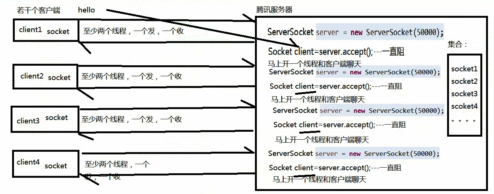
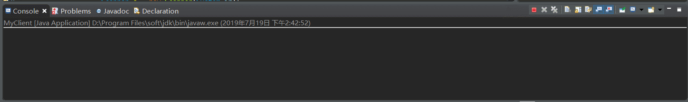

# 155-Java-网络编程实现简单的群聊功能.md



```
package chat3.client;

import java.io.BufferedReader;
import java.io.InputStreamReader;
import java.net.Socket;

/**
 * 
* <p>Title: MyClient_receivemess_thread</p>  
* <p>
*	Description: 
*	收信息的线程
* </p> 
* @author xianxian 
* @date 2019年7月19日
 */
public class MyClient_receivemess_thread implements Runnable {

	private Socket client;
	
	public MyClient_receivemess_thread(Socket client) {
		super();
		this.client = client;
	}
	@Override
	public void run() {
		try(
				BufferedReader br = new BufferedReader(new InputStreamReader(client.getInputStream()));
				){
			while (true) {
				String message = br.readLine();
				System.out.println(message);
			}
		}catch(Exception e) {
			e.printStackTrace();
		}
	}
}
```
```
package chat3.client;

import java.io.OutputStreamWriter;
import java.io.PrintWriter;
import java.net.Socket;
import java.util.Scanner;

public class MyClient {

	public static void main(String[] args) {

		/**
		 * 需求：至少两个线程，
		 * 一 个发 信息
		 * 一个收信息
		 */
		Socket client = null;
		
		try {
			//此处的127.0.0.1相当于localhost
			client = new Socket("127.0.0.1",20000);
			
			
			//记得开一个子线程，不停的收取服务端转发过来的信息
			new Thread(new MyClient_receivemess_thread(client)).start();
			
			
			//希望能够群聊，我能发信息出去
			try(
					PrintWriter pw = new PrintWriter(new OutputStreamWriter(client.getOutputStream()),true);
					
					){
				while(true) {
					//控制台输入要发送的信息
					Scanner s = new Scanner(System.in);
					String message = s.next();
					pw.println(message);
				}
			}catch(Exception e) {
				e.printStackTrace();
			}
		}catch(Exception e) {
			e.printStackTrace();
		}
	}
}
```
```
package chat3.server;

import java.net.ServerSocket;
import java.net.Socket;
import java.util.ArrayList;
import java.util.Collections;
import java.util.List;


public class MyServer {
	/**
	 * 
	 * <p>Title: main</p>  
	 * <p>
	 * 	Description: 
	 * 需求分析：1. 服务端能够响应客户端的连接请求，不管多少个都可以响应
	 * 			2.客户端发送过来的信息，服务端可以转发给其他客户端
	 * </p>  
	 * @param args
	 */
	
	//存放客户端套接字的集合,为什么给集合上锁，支持并发访问，确保数据安全
	public static List<Socket> socketList = Collections.synchronizedList(new ArrayList<>());
	
	public static void main(String[] args) {
		//开一个服务端
		ServerSocket server = null;
		
		try {
			server = new ServerSocket(20000);
			
			while(true) {
				Socket client = server.accept();
				//拿到客户端套接字后需要做两件事：
				//1.把这个套接字放入集合中
				socketList.add(client);
				
				//2.开一个线程跟客户聊天，
				//其实不聊天，只是不停的接收客户端发
				//来的信息然后转发至其他客户端
				new Thread(new MyServer_chat_thread(client)).start();
			}
		} catch (Exception e) {
			e.printStackTrace();
		}
	}
}
```
```
package chat3.server;

import java.io.BufferedReader;
import java.io.InputStreamReader;
import java.io.OutputStreamWriter;
import java.io.PrintWriter;
import java.net.Socket;

/**
 * 
* <p>Title: MyServer_chat_thread</p>  
* <p>
*	Description: 
*	服务端和客户端聊天的线程类
*	需求：一直不停地接收客户端发来的信息然后转发至其他客户端
* </p> 
* @author xianxian 
* @date 2019年7月19日
 */
public class MyServer_chat_thread implements Runnable {

	private Socket client;//能够接收客端发送的信息，必定持有该客户端套接字
	
	public MyServer_chat_thread(Socket socket) {
		this.client = socket;//利用构造方法构造当前类的实例的同时，给套接字属性赋值
	}
	@Override
	public void run() {
		//一直不停地接收客户端发来的信息然后转发至其他客户端
		try(
				BufferedReader br = new BufferedReader(new InputStreamReader(client.getInputStream()));
				
				){
			String message = null;
			while(true) {
				message = br.readLine();//接收客户端发送的信息
				//转发
				for(Socket socket:MyServer.socketList) {
					//如果是自己发的信息，不用转发回自己
					if(socket == client) {
					
						continue;
					}else {
						//拿到每个客户端的套接字做什么呢？获取每个客户端的输出流，给各自的客户端发送信息
						//后面的参数true表明启动自动刷新功能
						PrintWriter pw = new PrintWriter(new OutputStreamWriter(socket.getOutputStream()),true);
						
						pw.println(message);
					}
				}
			}
		}catch(Exception e) {
			e.printStackTrace();
		}
	}
}
```
群聊功能测试：先启动MyServer再启动MyClient启动两次表明开咯两客户端，群聊功能如下图所示




**以上就是我关于 *Java网络编程实现简单的群聊功能*  知识点的整理与总结的全部内容,[另附源码](https://github.com/javaobjects/demo522)**

==================================================================
#### 分割线
==================================================================

**博主为咯学编程：父母不同意学编程，现已断绝关系;恋人不同意学编程，现已分手;亲戚不同意学编程，现已断绝来往;老板不同意学编程,现已失业三十年。。。。。。如果此博文有帮到你欢迎打赏，金额不限。。。**

